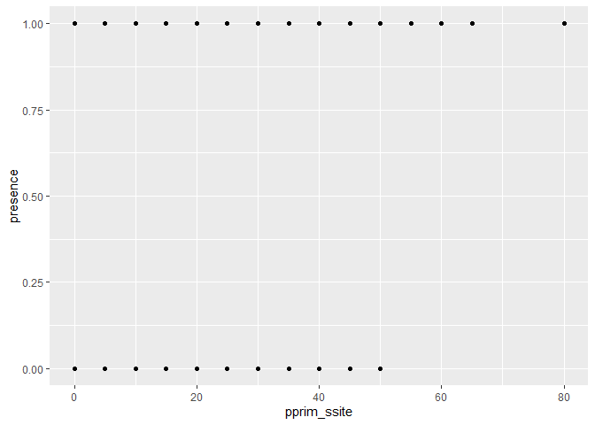
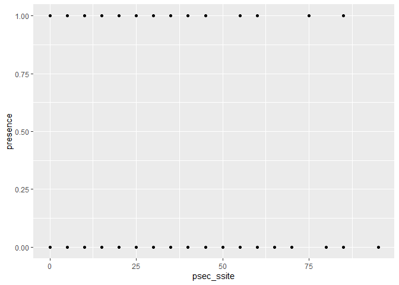
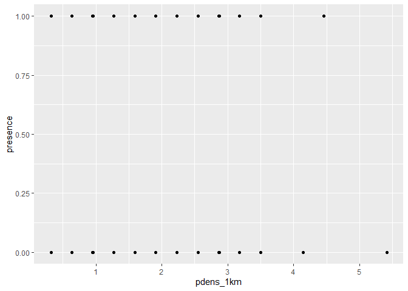
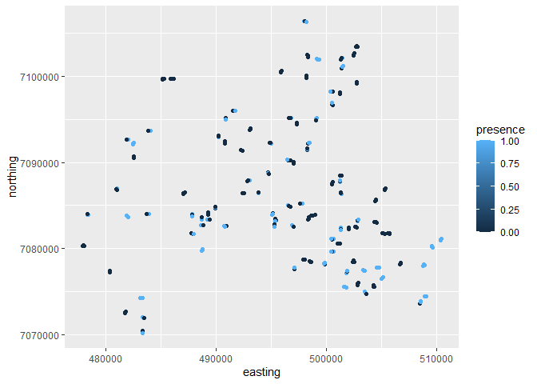
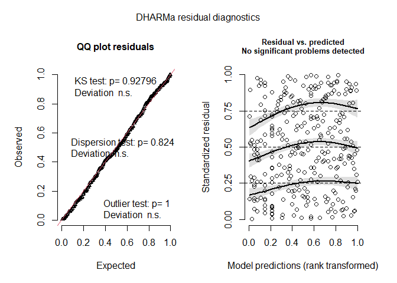
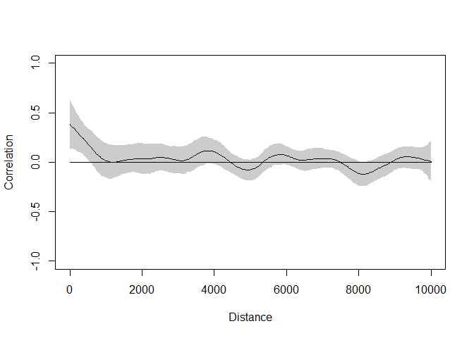
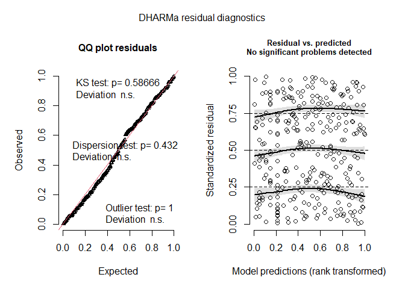
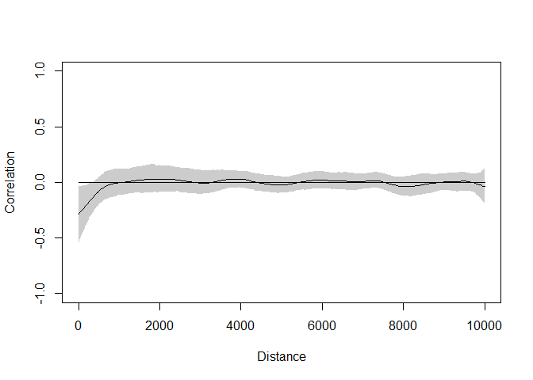
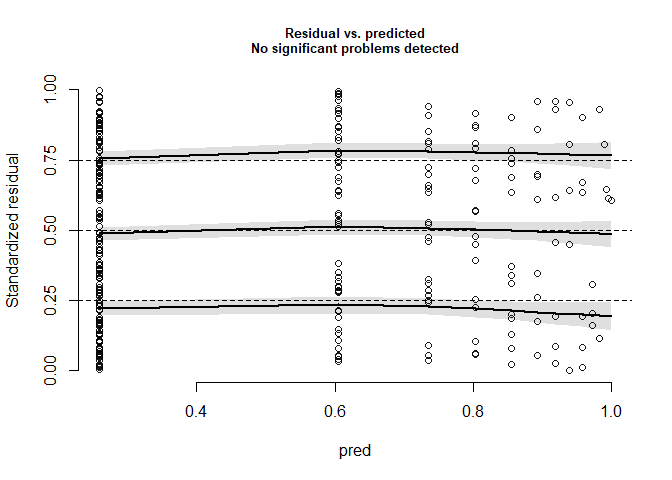
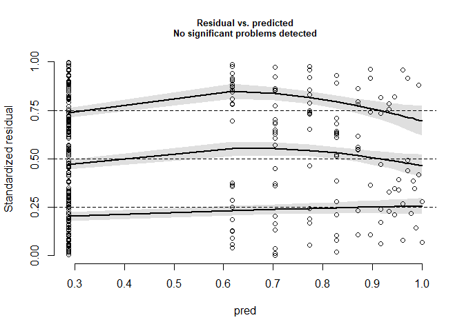

An introduction to GLMMs
================
Adapted by M. Pinsky from Zuur et al. 2009 Ch. 21 and the DHARMa
tutorial
3/30/2021

## Introduction

Predicting the spatial distribution of wildlife populations is an
important component of the development of management strategies for
their conservation. Landscape structure and composition are important
determinants of where species occur and the viability of their
populations. In this exercise, we will model the impact of landscape
pattern on the distribution of koalas (*Phascolarctos cinereus*) in a
landscape in eastern Australia.

The study area we consider for this chapter is the Noosa Local
Government Area (LGA) in southeast Queensland, Australia (Fig. 21.2).
Noosa has a subtropical coastal climate Over 50% of the original
eucalypt forests have been cleared for farming and urban development.
Koalas are, therefore, threatened by the loss and fragmentation of their
habitat and by threats associated with urbanisation, such as cars and
domestic dogs.

We will use generalised linear mixed effects models (GLMM) to model the
distribution of koalas using data on their presence and absence at sites
located across the study area. We also take a multi-scale approach in
the sense that our explanatory variables will be landscape
characteristics measured at different landscape extents. The analysis
concentrates on dealing with collinearity and spatial auto-correlation
for these types of landscape models.

## Data

The data presented are based on surveys that were conducted to determine
koala presence or absence at 300 locations in Noosa. Using a form of
stratified random sampling, 100 sites were first located across the
Noosa LGA. Then, within each site, three subsites were located 100 m
apart. At each subsite, the presence or absence of koalas was then
determined using standardised searches for koala faecal pellets around
the bases of trees. Previous work has identified the koala’s preferred
tree species in Noosa and these have been classified into primary,
secondary, and supplementary species. At each subsite, the percentage of
trees that were primary and secondary species was recorded. Finally, the
distribution of koala habitat (classified into highly suitable,
suitable, marginal, and unsuitable habitat) was mapped.

The data on the presence/absence of koalas will be the response variable
for our analysis, while the data on preferred tree species and habitat
will form the basis of the explanatory variables.

The data frame contains a row for each subsite. The columns:

  - `site`: site ID
  - `subsite`: subsite ID numbers
  - `easting`: eastings of the location of each subsite (in AMG ADG 1966
    coordinates)
  - `northing`: northings
  - `presence`: whether koala pellets were found at the subsite (= 1) or
    not found at the subsite (= 0)
  - `pprim_ssite`: %trees in each subsite that are primary tree species
  - `psec_ssite`: %trees in each subsite that are secondary tree species
  - `pdens_1km`: density of habitat patches (patches/100 ha), consisting
    of highly suitable plus suitable plus marginal habitat, in the
    landscape within 1 km of each subsite

<!-- end list -->

``` r
koalas <- readRDS(url('https://github.com/aeda2021/2021_master/raw/main/raw-data/koalas.rds'))
```

## Data exploration

Two important issues to consider before building regression models of
species’ distributions are whether there is high collinearity between
the explanatory variables and whether spatial auto-correlation between
data points is likely to be an important factor. High collinearity can
result in coefficient estimates that are difficult to interpret as
independent effects and/or have high standard errors. Positive spatial
auto-correlation violates the usual assumption of independence between
data points and leads to the underestimation of standard errors, and
elevated type I errors, if not accounted for. Collinearity between
explanatory variables and spatial auto-correlation are commonly
encountered when using observational data to construct regression models
of species’ distributions. For both these issues, we examine whether
they are likely to be a problem for the analysis of our dataset and then
discuss how they can be addressed.

### Plots

Let’s start by making some plots of the response variable vs. each of
the explanatory variables. It’s also helpful to make a map (plot
response as dot color vs. northing and easting)

``` r
library(ggplot2)
ggplot(koalas, aes(x = pprim_ssite, y = presence))+
    geom_point()
```

<!-- -->

``` r
ggplot(koalas, aes(x = psec_ssite, y = presence))+
    geom_point()
```

<!-- -->

``` r
ggplot(koalas, aes(x = pdens_1km, y = presence))+
    geom_point()
```

<!-- -->

``` r
ggplot()+
    geom_point(data=koalas, aes(x=easting, y=northing, color=presence))
```

<!-- -->

### Evaluate colinearity

A simple first step for identifying collinearity is to look at the
pairwise correlations between explanatory variables. We’ll use the
Spearman rank correlation coefficient, rather than the Pearson
correlation coefficient because the Spearman rank correlation makes no
assumptions about linearity in the relationship between the two
variables. A rough guideline is that correlations between pairs of
variables with magnitudes greater than ±0.5 indicate high collinearity.

There are several strategies that we could use to deal with collinearity
found between the explanatory variables. These include (i) simply
removing one or more variables so that the remaining variables are not
highly correlated, (ii) using linear combinations of the variables
rather than the variables directly in the model, or (iii) using biased
estimation procedures such as principal components regression or ridge
regression. The first two are most straightforward.

The explanatory variables are in columns 6:8, so an easy approach use to
use `pairs()` and `cor(..., method = 'spearman')` on `koalas[, 6:8]`.

Please use the code block below.

``` r
pairs(koalas[, 6:8])
```

<!-- -->

``` r
cor(koalas[,6],koalas[,7],method="spearman")
```

    ## [1] -0.191208

``` r
cor(koalas[,6],koalas[,8],method="spearman")
```

    ## [1] -0.01711065

``` r
cor(koalas[,7],koalas[,8],method="spearman")
```

    ## [1] 0.1229465

#### Q1: Do you see signs of colinearity that concern you? If so, which ones?

# I don’t see the sign of colinearity, none of them are higher than 0.5 to be concerned as a high colinearity.

## Evaluate spatial autocorrelation

There are two reasons for expecting spatial auto-correlation in the
presence/absence data. First, spatial auto-correlation at the site-scale
may occur because the distances between the subsites within individual
sites are small relative to the size of koala home ranges. Average koala
home range sizes in similar east coast habitats have been estimated at
between 10–25 ha for females and 20–90 ha for males. Therefore, the
occurrences of koalas at subsites within an individual site will tend to
be correlated because they would often have been located within the same
koala’s home range.

Second, spatial auto-correlation at broader scales may occur due to
spatially constrained dispersal of koalas from their natal home ranges.
Koala dispersal distances in nearby regions have been recorded to be
around 3–4 km, but can be as high as 10 km. So, dispersal distances are
substantially smaller than the spatial extent of the study area, and
this could also lead to spatial auto-correlation between sites. We could
also see spatial auto-correlation in the presence/absence data if the
underlying spatial pattern of habitat is spatially auto-correlated.
However, we would expect our explanatory variables to account for most
of the spatial auto-correlation from this source once the regression
model is fitted to the data and is therefore considered to be of less
concern.

One way to assess the extent of spatial auto-correlation is to look at
correlograms of the data. Correlograms are graphical representations of
the spatial correlation between locations at a range of lag distances.
Positive spatial correlation indicates that spatial autocorrelation
between data points may be a problem. Negative spatial correlation may
also indicate a problem, but this is fairly unusual in this kind of
data; so we are mainly concerned with positive correlations. We use a
spline correlogram to investigate auto-correlation in the
presence/absence data. The spline correlogram that we use is essentially
a correlogram that is smoothed using a spline function.

We will first look at spatial auto-correlation in the raw data. However,
we are predominantly interested in whether there is any spatial
auto-correlation in model residuals once any spatial auto-correlation
explained by the explanatory variables has been accounted for.

A spline correlogram of the raw presence/absence data can be plotted
using the code below. The `spline.correlog()` function does 1000
bootstraps to calculate 95% confidence intervals up to a maximum lag
distance of 10 km and may take a few minutes to run.

``` r
correlog <- spline.correlog(x = koalas$easting,
                            y = koalas$northing,
                            z = koalas$presence, 
                            xmax = 10000)
```

    ## 100  of  1000 200  of  1000 300  of  1000 400  of  1000 500  of  1000 600  of  1000 700  of  1000 800  of  1000 900  of  1000 1000  of  1000 

``` r
plot(correlog)
```

<!-- --> \#\#\#\# Q2: Do
you see positive spatial auto-correlation that we should be concerned
about? If so, at what scales?

# I can see a positive spatial auto-correlation in distance within 1000 m. We can see the correlation decreased within 1000 m.After 2000 m, the correlation is

# oscillating around zero, so it’s hard to tell the value.

## Standardize the explanatory variables

Before fitting models to the data, the explanatory variables should be
standardized so that they each have a mean of zero and standard
deviation of one. This helps to improve convergence of the fitting
algorithm and puts the estimated coefficients on the same scale,
allowing effect sizes to be more easily compared. We can standardize the
explanatory variables by applying a function to each of the columns with
explanatory variables:

``` r
koalas_st <- cbind(koalas[, 1:5],
                   apply(X = koalas[, 6:ncol(koalas)], 
                         MARGIN = 2, 
                         FUN = function(x){(x - mean(x)) / sd(x)}
                         )
                   )
```

## Fit a first model (GLM)

Our response variable is presence/absence, and so it is not going to
have nice Gaussian distribution. Please choose a more appropriate error
distribution and fit a `glm()` with presence as the response variable
and `pprim_ssite`, `psec_ssite`, and `pdens_1km` as the explanatory
variables. Use `koalas_st` as your data source since it has the
standardized variables. Save your model in `mod_glm` so that it works
with some later code we’ll use.

``` r
mod_glm <- glm(presence ~ pprim_ssite+psec_ssite+pdens_1km, family = 'binomial', data = koalas_st)
```

Just for good measure, use `summary()` to take a quick look:

``` r
summary(mod_glm)
```

    ## 
    ## Call:
    ## glm(formula = presence ~ pprim_ssite + psec_ssite + pdens_1km, 
    ##     family = "binomial", data = koalas_st)
    ## 
    ## Deviance Residuals: 
    ##     Min       1Q   Median       3Q      Max  
    ## -1.6018  -0.9151  -0.8527   1.3675   1.5563  
    ## 
    ## Coefficients:
    ##              Estimate Std. Error z value Pr(>|z|)    
    ## (Intercept) -0.498530   0.121981  -4.087 4.37e-05 ***
    ## pprim_ssite  0.468638   0.130019   3.604 0.000313 ***
    ## psec_ssite   0.073048   0.121909   0.599 0.549037    
    ## pdens_1km   -0.007958   0.122335  -0.065 0.948136    
    ## ---
    ## Signif. codes:  0 '***' 0.001 '**' 0.01 '*' 0.05 '.' 0.1 ' ' 1
    ## 
    ## (Dispersion parameter for binomial family taken to be 1)
    ## 
    ##     Null deviance: 398.44  on 299  degrees of freedom
    ## Residual deviance: 383.96  on 296  degrees of freedom
    ## AIC: 391.96
    ## 
    ## Number of Fisher Scoring iterations: 4

### Evaluate the model

How well does our model fit? Evaluating GLM(M)s can be hard, let’s look
using the DHARMa package. As you read, the basic steps are

  - Simulate new data from the fitted model for each observation.
  - For each observation, calculate the empirical cumulative density
    function for the simulated observations, which describes the
    possible values (and their probability) at the predictor combination
    of the observed value, assuming the fitted model is correct.
  - The residual is then defined as the value of the empirical density
    function at the value of the observed data, so a residual of 0 means
    that all simulated values are larger than the observed value, and a
    residual of 0.5 means half of the simulated values are larger than
    the observed value.

If the observed data were created from the same data-generating process
that we simulate from, all values of the cumulative distribution should
appear with equal probability. That means we expect the distribution of
the residuals to be flat, regardless of the model structure (Poisson,
binomial, random effects and so on).

First step is to simulate the randomized quantile residuals. Default is
250 simulations.

``` r
res_glm <- simulateResiduals(fittedModel = mod_glm, plot = F)
```

Then plot them.

``` r
plot(res_glm)
```

<!-- -->

On the left is a qq-plot to detect overall deviations from the expected
distribution, by default with added tests for correct distribution (KS
test), dispersion and outliers. We want the residuals (black dots) to
line up on the red line for the expected distribution. The DHARMa
tutorial section on “Recognizing over/underdispersion” is good for
interpreting deviations from this.

On the right panel is a plot of the residuals against the predicted
value. Simulation outliers are highlighted as red stars. These points
should be carefully interpreted, because we actually don’t know “how
much” these values deviate from the model expectation. Note that
outliers in DHARMa are values that are by default defined as values
outside the simulation envelope, not in terms of a particular quantile.
Note also that the probability of an outlier depends on the number of
simulations, so whether the existence of outliers is a reason for
concern depends also on the number of simulations (n=250 above).

To provide a visual aid in detecting deviations from uniformity in
y-direction, the plot function calculates a quantile regression, which
compares the empirical 0.25, 0.5 and 0.75 quantiles in the y-direction
(solid lines) with the theoretical 0.25, 0.5 and 0.75 quantiles (dashed
black line), and provides a p-value for the deviation from the expected
quantile. The significance of the deviation to the expected quantiles is
tested and displayed visually.

#### Q3: Evaluate the QQ plot and the residuals vs. predicted plots. If you see any concerns, please describe them.

# For the QQ plot, the overall deviations from the expected distribution are nicely lining up on the red line, and this is exactly what we want to see.

# For the residuals vs. predicted plot, we can see the black line is a little bit curved around the dotted line. But I think it’s fine to say that

# our residuals and the predicted values have little or no diviations.

### Evaluate spatial auto-correlation in the GLM

We were concerned about spatial auto-correlation in our raw data, so
let’s see if including the explanatory variables solved this. Use the
same code that you used earlier for the spline correlogram, but now use
`resid(mod_glm)` as the z axis.

``` r
correlog1 <- spline.correlog(x = koalas$easting,
                            y = koalas$northing,
                            z = resid(mod_glm), 
                            xmax = 10000)
```

    ## 100  of  1000 200  of  1000 300  of  1000 400  of  1000 500  of  1000 600  of  1000 700  of  1000 800  of  1000 900  of  1000 1000  of  1000 

``` r
plot(correlog1)
```

<!-- -->

#### Q4: Do you see evidence of spatial auto-correlation in the residuals? At what spatial scale? How does this relate to the study design?

# Yes, I can still see the spatial auto-correlation within 1000m. From this point, we can understand the setup of the subsites for the koalas, which

# may have overlaps of different koalas home ranges.

## Fit a GLMM

As you learned in the reading, GLMMs are useful when data are
hierarchically structured in some way. They account for dependencies
within hierarchical groups through the introduction of random-effects.
In this study, the data are hierarchically structured in the sense that
subsites are nested within sites, and we want to use mixed effects
models to account for the spatial dependencies within sites. A suitable
mixed effects model for these purposes can be constructed by introducing
a random-effect for site into the standard logistic regression model.

As you also read (e.g., Ben Bolker’s FAQ), GLMMs are not simple to fit
or interpret. The methods continue to evolve. Here, we will use the
glmmTMB package developed by Ben Bolker. As a note, it also has some
nice features for considering zero-inflated data and heteroscedasticity
that we won’t get into today.

The syntax for glmmTMB is like `lmer()` in lme4 and like `glm()`, which
is nice. See `?glmmTMB` for more information.

    model <- glmmTMB(response ~ explanantoryvars + (1|random), data=mydata, family=family) # a random intercept model
    model <- glmmTMB(response ~ explanantoryvars + (slope|random), data=mydata, family=family) # a random intercept and slope model

Here, we’ll use `site` as a random effect to help account for the
spatial auto-correlation and pseudoreplication at that scale.

In the code block below, fit a GLMM using `glmmTMB()` with
`pprim_ssite`, `psec_ssite`, and `pdens_1km` as your explanatory
variables (like your GLM) and `site` as a random intercept. Make sure to
pick a family that makes sense for these data. Use `koalas_st` as your
data source and save to `mod_glmm`.

``` r
mod_glmm <- glmmTMB(presence~pprim_ssite+psec_ssite+pdens_1km+(1|site), data = koalas_st,family = 'binomial')
```

Take a look with `summary()` on your GLMM.

``` r
summary(mod_glmm)
```

    ##  Family: binomial  ( logit )
    ## Formula:          presence ~ pprim_ssite + psec_ssite + pdens_1km + (1 | site)
    ## Data: koalas_st
    ## 
    ##      AIC      BIC   logLik deviance df.resid 
    ##    369.7    388.2   -179.9    359.7      295 
    ## 
    ## Random effects:
    ## 
    ## Conditional model:
    ##  Groups Name        Variance Std.Dev.
    ##  site   (Intercept) 2.729    1.652   
    ## Number of obs: 300, groups:  site, 100
    ## 
    ## Conditional model:
    ##              Estimate Std. Error z value Pr(>|z|)    
    ## (Intercept) -0.761683   0.242537  -3.140 0.001687 ** 
    ## pprim_ssite  0.833103   0.230271   3.618 0.000297 ***
    ## psec_ssite   0.197584   0.198068   0.998 0.318494    
    ## pdens_1km   -0.009749   0.211130  -0.046 0.963172    
    ## ---
    ## Signif. codes:  0 '***' 0.001 '**' 0.01 '*' 0.05 '.' 0.1 ' ' 1

### Evaluate the model

Go ahead and evaluate your GLMM using

  - DHARMa simulated residuals and standard plots
  - a spatial correlogram of the residuals

as you did for the GLM.

``` r
res_glmm <- simulateResiduals(fittedModel = mod_glmm, plot = F)
plot(res_glmm)
```

<!-- -->

``` r
correlog2 <- spline.correlog(x = koalas$easting,
                            y = koalas$northing,
                            z = resid(mod_glmm), 
                            xmax = 10000)
```

    ## 100  of  1000 200  of  1000 300  of  1000 400  of  1000 500  of  1000 600  of  1000 700  of  1000 800  of  1000 900  of  1000 1000  of  1000 

``` r
plot(correlog2)
```

<!-- -->

It is also good practice to plot the residuals against each of the
explanatory variables. You can do this in DHARMa with the syntax

    plotResiduals(simulationOutput, yourData$variable)

Go ahead and do this for the three explanatory variables below:

``` r
plotResiduals(mod_glmm,koalas_st$pprim_ssite)
```

<!-- -->

``` r
plotResiduals(mod_glmm,koalas_st$psec_ssite)
```

<!-- -->

``` r
plotResiduals(mod_glmm,koalas_st$pdens_1km)
```

<!-- -->

#### Q5: Evaluate the QQ plot, the residuals vs. predicted plot, the spline correlogram, and the residuals vs. explantory variables. Does anything concern you?

# The QQ plot looks good and the residuals vs. predicted plot looks better than mod\_glm, the dark line is more fitted to the dotted line.

# The residuals vs. explantory variables plots are all in good shapes. The only thing to concern is the plot for “psec\_ssite” is more curved than expected, which

# might indicate some differences between residuals and predicted values for psec\_ssite.

## Fit an alternative GLMM

We can also compare among GLMMs with AIC. Fit a new GLMM like your first
but with only site-scale variables in it (only `pprim_ssite` and
`psec_ssite`).

``` r
mod_glmm2 <- glmmTMB(presence~pprim_ssite+psec_ssite+(1|site), data = koalas_st,family = 'binomial')
```

### Compare the models

Now compare your models. You can use the syntax

    AIC(model1, model2)

``` r
AIC(mod_glmm,mod_glmm2)
```

    ##           df      AIC
    ## mod_glmm   5 369.7018
    ## mod_glmm2  4 367.7040

#### Q6: Which model appears to be parsimonious according to AIC? What have you learned about koala spatial distributions?

# The second model with only site-scale variables appers to be parsimonious. But their AIC value don’t show a big difference, I think this is because AIC calculation

# will getting higher if we have a higher degree of freedom. So, I learned that koala spatial distributions are depending on the percentage primary and secondary tree

# species, but also somehow related to the density of habitat patches. For the tree speices, we can see from the summary of mod\_glmm, koalas really prefer primary tree.

When you’re done, click “Knit” above to turn this into a Github document
that will display nicely on Github. It will also create a sub-directory
with the image files in it. Commit everything to your Git repo, and push
to Github. **Congratulations\!**
